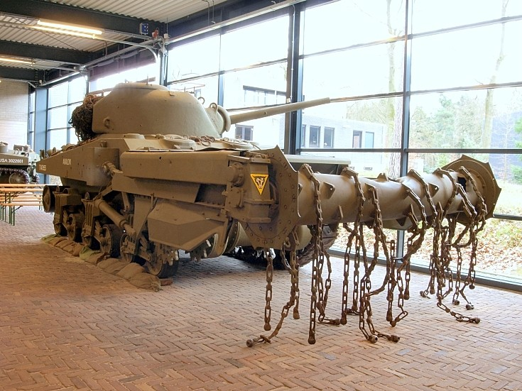

User Manual for Team X's MineSweeper
===

## Getting the application
*REPLACE THIS:*  Describe how someone should clone a public GitHub repo from one of your team members' GitHub accounts.  (You can assume the user has a git client installed.)

## Running the application
*REPLACE THIS:* Describe how the user would compile (build) the downloaded application and how to start the app.  (You can assume the user has a suitable JDK installed on their system.)

Here's a sample ordered list you might modify to suit your needs:

1.  From a comand prompt (or terminal shell), `cd` to the directory where you cloned the `MineSweeper-2015-alpha` repository.
2.  Step 2
	1.  Step 2a
	2.  Step 2b

## Playing the Game
### Objective
Insert text here...

### Controlling the game
Insert text here...

*Describe how the user actually plays the game.  **Strongly** consider including screenshots by adding an image file to the `images` subfolder and referring to it as in the example below.  Remember to `git add/commit/push` the image files!*

