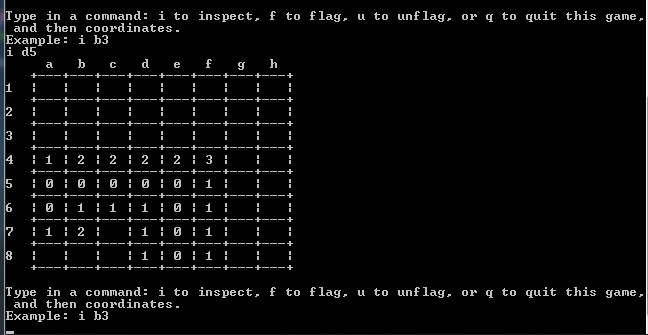
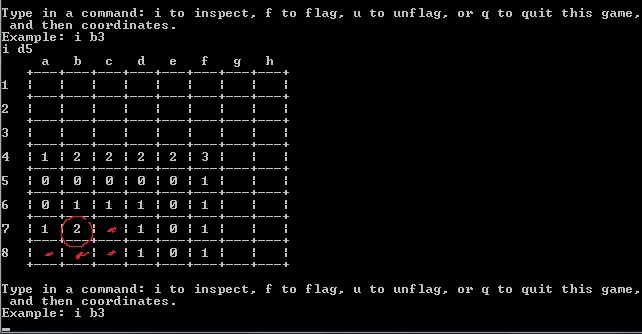
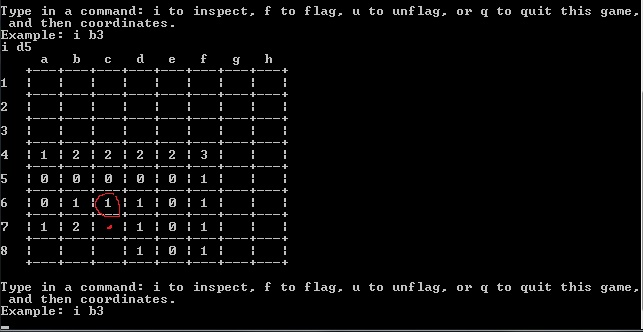

User Manual for Team P's MineSweeper
===

## Getting the application
1. Open terminal shell.
2. Change directory to where you want your project to be stored.
3. Navigate the project's repository URL on github and copy the link
4. On terminal shell, type in the command: `git clone URL`. Replace URL with link copied in step 3. Hit enter.
5. On eclipse, create a project and name it based on the repository that you copied.
6. Refresh the newly created project.

## Running the application
1.  From a command prompt (or terminal shell), `cd` to the directory where you cloned the `MineSweeperP` repository.
2.  cd to 'src'
3.  Compile the driver class by inputting command `javac edu/balboa/apcs/MineSweeper/MineSweeper.java`. Hit enter.
4.  Run the driver class by inputting command `java edu.balboa.apcs.MineSweeper.MineSweeper`. Hit enter.
5.  Play the game.

## Playing the Game
### Objective
The objectives of the game are to mark all mines with flags and flip all the squares on the grid without flipping any squares with mines. 
### Controlling the game
The game is based on rows and columns, where rows are represented by numbers and columns are represented by letters. To interact with the game, the user must input a letter i(inspect), f(flag), u(unflag), q(quit). Letters i,f, and u must be followed by a set of coordinates in the format (letter,number). A sample command would be "i b5". This prompts the application to inspect the square that corresponds with the coordinate at column b, row 5.

